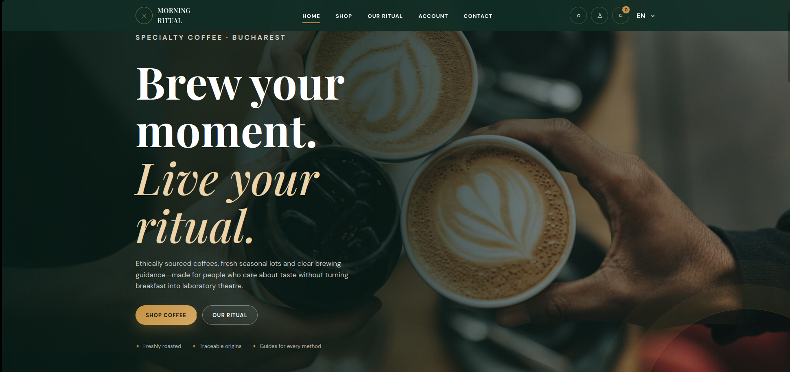
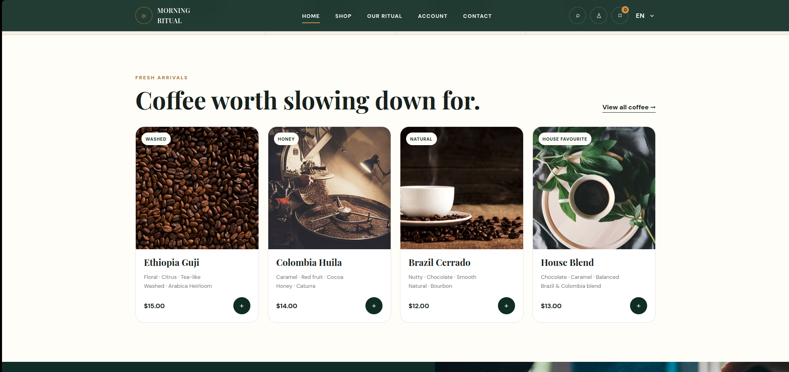
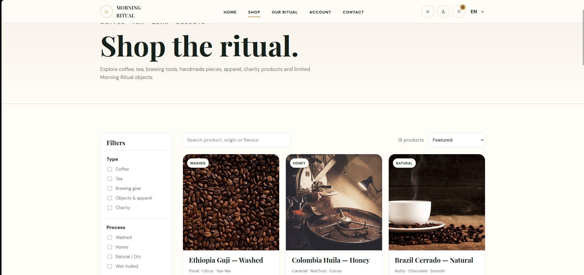
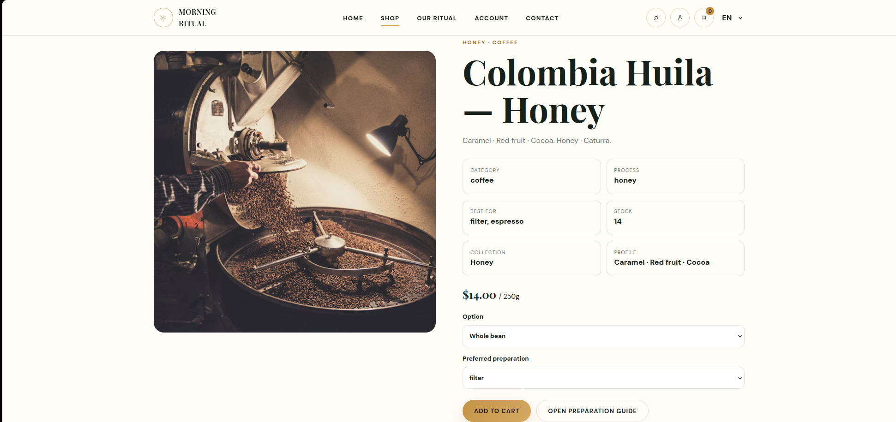
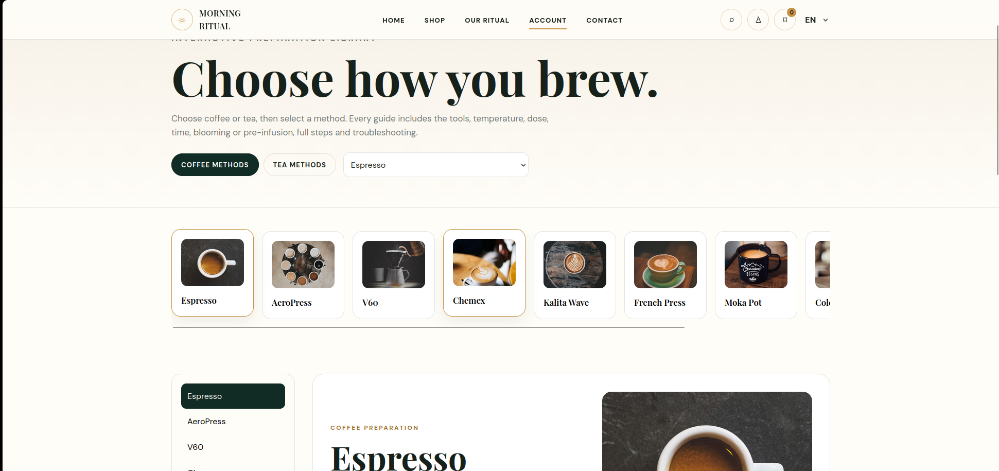
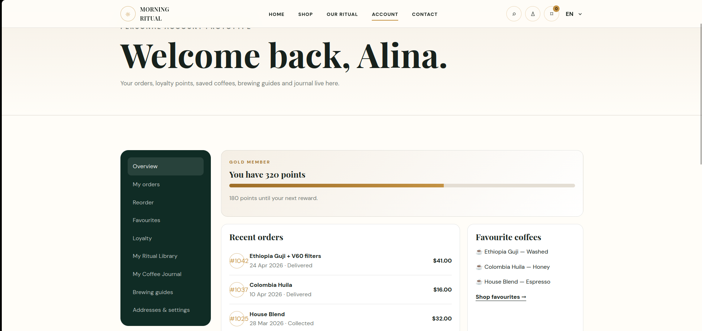
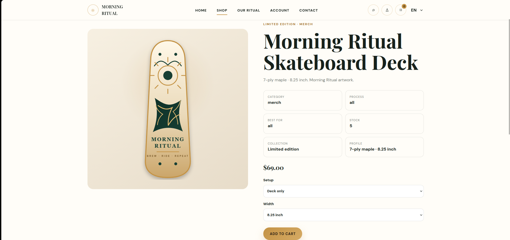
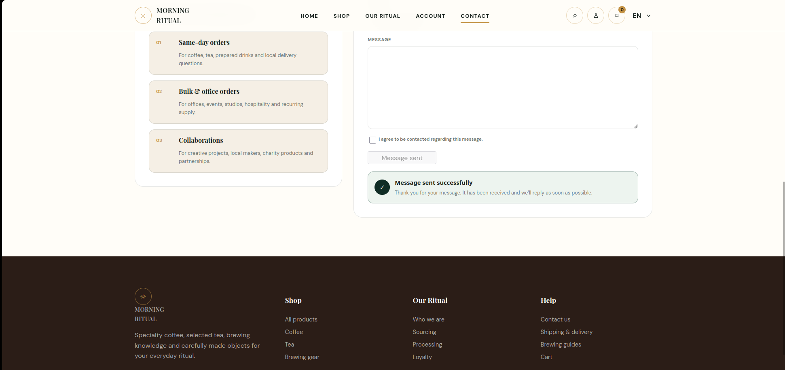

# Morning Ritual

### Specialty coffee e-commerce and brewing experience

A responsive web project that connects product discovery, preparation education, customer loyalty and a calm visual identity.

[**View Live Website**](https://alinaxa.github.io/morningritual/) · [**View Source Code**](https://github.com/AlinaXa/morningritual)

 

---

## Overview

Morning Ritual began as a simple café website and evolved into a complete specialty coffee e-commerce experience. The project combines a refined storefront with detailed product information, interactive preparation guides and customer-focused features that continue after purchase.

The interface is available in **English and Romanian** and is built entirely with **HTML, CSS and vanilla JavaScript**.

## Main features

- responsive home page and product discovery experience;
- functional shop filters, search and sorting;
- coffee, tea, brewing equipment, apparel, handmade objects and charity products;
- dynamic product pages with stock, processing method, flavour profile and preparation options;
- T-shirt size selection from XS to XXL;
- original Morning Ritual skateboard artwork created with SVG and CSS;
- interactive coffee and tea preparation library;
- tools, ratios, temperatures, timing, blooming, pre-infusion and troubleshooting;
- personal account concept with orders, favourites and loyalty points;
- Coffee & Tea Journal saved with LocalStorage;
- cart and checkout flow;
- bilingual EN / RO interface;
- working contact form with Web3Forms and visible success confirmation;
- responsive navigation and mobile layouts.

## Screenshots

| Product discovery | Shop filters |
|---|---|
|  |  |

| Product page | Brewing library |
|---|---|
|  |  |

| Customer account | Skateboard product |
|---|---|
|  |  |

| Contact confirmation |
|---|
|  |

## Technologies

| Area | Technology |
|---|---|
| Structure | HTML5 |
| Styling | CSS3 |
| Interactions | Vanilla JavaScript |
| Local data | LocalStorage |
| Contact form | Web3Forms |
| Hosting | GitHub Pages |

## Project structure

- `index.html` — home page;
- `shop.html` — catalogue, filters, search and sorting;
- `product.html` — dynamic product details;
- `brew-guide.html` — coffee and tea preparation library;
- `account.html` — account and loyalty concept;
- `journal.html` — personal preparation journal;
- `cart.html` — cart and checkout flow;
- `ritual.html` — sourcing, processing and brand story;
- `contact.html` — working contact form.

## Live project

**Website:** https://alinaxa.github.io/morningritual/

## Project status

Designed, developed, tested and published.

## Author

**Alina Bratu**  
UI/UX Design · Front-end Development · Interaction Design · Product Concept
